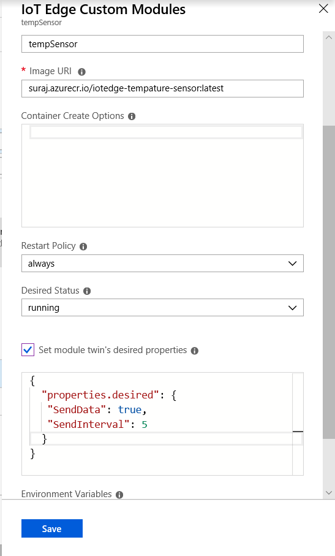

# azureIoTEdgeTempSensor


 ## Goal
To generate simulated sensor data , in edge module and push to filter module for filteration of temperature data 
## Development Language 
 C# Core
## Refered from 

https://github.com/Azure/iot-edge-v1/tree/master/v2/samples/azureiotedge-simulated-temperature-sensor

# Few changes made 
1. the moduleClient is used instead of DeviceClient
2. Removed security and install certificate

## Steps to deploy as module :
1. Select a instance where docker/iotedge is configured.
2. Build a image from the dockerfile
3. Tag and push the image to repository
4. Ensure the module is configured in the Azure IoT EDGE and the container registry credentials are given

## Device Twin 

Create the device twin as in below image and save



## Expect behaviour:
To send all the temperature related data to filter module 
as defined in routes as (please check the routes tempSensorTotempSensorFilter)

```
{
  "routes": {
    "tempSensorFilterToIoTHub": "FROM /messages/modules/tempSensorFilter/outputs/* INTO $upstream",
    "tempSensorTotempSensorFilter": "FROM /messages/modules/tempSensor/outputs/temperatureOutput  INTO BrokeredEndpoint(\"/modules/tempSensorFilter/inputs/input1\")"
  }
}
```

## Dependend repositories

1. https://github.com/SURAJTHEGREAT/toAzureEventsHubCosmosDB
2. https://github.com/SURAJTHEGREAT/azureEdgeSensorFilter
3. https://github.com/SURAJTHEGREAT/azureIotEdgeTempSensor


